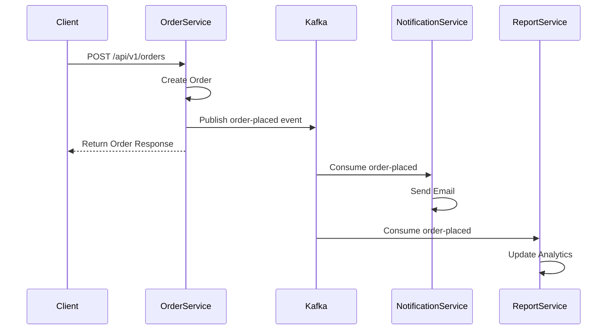

# 📚 Book Store & Rental Microservices Platform

A scalable, cloud-native backend architecture for a modern Book Store and Book Rental application. Built with **Java 17+, Spring Boot 3.x**, supporting both synchronous (REST) and asynchronous (event-driven) communication patterns.

---

## **🚀 Project Status**

### **Currently Implemented** ✅

| Service      | Port | Java | Spring Boot | Status       | Features                                      |
| ------------ | ---- | ---- | ----------- | ------------ | --------------------------------------------- |
| User Service | 8081 | 17   | 3.5.12      | ✅ Active    | User management, Eureka discovery ready       |
| Book Service | 8082 | 17   | 3.5.12      | ✅ Active    | Book & category management, Redis caching     |

### **Planned Services** 🗓️

- 🚪 **API Gateway** (Port 8080) - Spring Cloud Gateway
- 📦 **Inventory Service** (Port 8083) - Stock management with Redis
- 🛒 **Order Service** (Port 8084) - Orders & purchases with Kafka
- 📅 **Rental Service** (Port 8085) - Rental lifecycle management
- 📧 **Notification Service** (Port 8086) - Email/SMS notifications
- 📊 **Report Service** (Port 8087) - Analytics & reporting
- 🔐 **Auth Service** (Port 8088) - Authentication with JWT

---

## **📁 Project Structure**

```
book-nest/
│
├── book-service/                    # 📖 Book Catalog Service (✅ ACTIVE)
│   ├── src/main/java/.../
│   │   ├── controller/              # BookController, CategoryController
│   │   ├── service/                 # Business logic
│   │   ├── repository/              # JPA repositories
│   │   ├── model/                   # JPA entities
│   │   ├── dto/                     # Data Transfer Objects
│   │   ├── mapper/                  # MapStruct mappers
│   │   ├── exception/               # Custom exceptions
│   │   └── config/                  # OpenAPI, Cache config
│   ├── src/main/resources/
│   │   └── application.properties    # PostgreSQL, Redis, logging
│   ├── pom.xml
│   └── Dockerfile
│
├── user-service/                    # 👥 User Management Service (✅ ACTIVE)
│   ├── src/main/java/.../
│   │   ├── controller/              # UserController
│   │   ├── service/                 # User service logic
│   │   ├── repository/              # JPA repositories
│   │   ├── model/                   # User entities
│   │   ├── dto/                     # DTOs
│   │   └── mapper/                  # Mappers
│   ├── src/main/resources/
│   │   └── application.yml          # PostgreSQL config, Eureka ready
│   ├── pom.xml
│   └── Dockerfile
│
├── pom.xml                          # Multi-module parent POM
├── README.md                        # This file
└── .gitignore
```

---

## **🔧 Prerequisites**

- ✅ **Java 17+** (OpenJDK recommended)
- ✅ **Maven 3.8+** (or use `mvn` wrapper)
- ✅ **PostgreSQL 14+** (local or Docker)
- ✅ **Redis** (optional, for Book Service caching)
- ✅ **Docker & Docker Compose** (for infrastructure)

---

## **⚡ Quick Start Guide**

### **Option 1: Local Setup (Development)**

#### **1. Set Up Databases**

```bash
# Create databases for both services
createdb userdb
createdb book_service

# Or using Docker
docker pull postgres:15-alpine
docker run --name postgres-local \
  -e POSTGRES_PASSWORD=password \
  -p 5432:5432 \
  -d postgres:15-alpine

# Create databases
docker exec postgres-local createdb -U postgres userdb
docker exec postgres-local createdb -U postgres book_service
```

#### **2. Start Redis (Optional, for Book Service caching)**

```bash
docker run --name redis-local \
  -p 6379:6379 \
  -d redis:7-alpine
```

#### **3. Build the Project**

```bash
# From project root
mvn clean compile

# Or build individual services
mvn -pl user-service clean package
mvn -pl book-service clean package
```

#### **4. Start Services**

**Terminal 1: User Service**

```bash
cd user-service
mvn spring-boot:run
# Service available at: http://localhost:8081
```

**Terminal 2: Book Service**

```bash
cd book-service
mvn spring-boot:run
# Service available at: http://localhost:8082
# API Docs: http://localhost:8082/swagger-ui/index.html
```

### **Option 2: Docker Setup (Complete Infrastructure)**

Once Docker Compose is configured:

```bash
# Start all infrastructure + services
docker-compose up -d

# Verify services
docker-compose ps

# View logs
docker-compose logs -f

# Stop everything
docker-compose down
```

---

## **📊 Service Details**

### **📖 Book Service (Port 8082)**

**Status:** ✅ Fully Implemented

**Technology Stack:**
- Spring Boot 3.5.12
- Spring Data JPA with PostgreSQL
- Redis for caching
- MapStruct for DTOs
- OpenAPI 3.0 (Swagger)
- Micrometer metrics

**Features:**
- ✅ Complete CRUD operations for books
- ✅ Category management
- ✅ Search and filtering
- ✅ Redis caching layer
- ✅ RESTful API with OpenAPI documentation
- ✅ Health checks and metrics

**Key Endpoints:**
```bash
# Books
GET    /api/v1/books                 # List all books
GET    /api/v1/books/{id}            # Get book details
POST   /api/v1/books                 # Create new book
PUT    /api/v1/books/{id}            # Update book
DELETE /api/v1/books/{id}            # Delete book

# Categories
GET    /api/v1/categories            # List all categories
GET    /api/v1/categories/{id}       # Get category details
POST   /api/v1/categories            # Create category

# Health & Metrics
GET    /actuator/health              # Service health
GET    /actuator/metrics             # Service metrics
```

**Configuration:**
```properties
spring.application.name=book-service
server.port=8082
spring.datasource.url=jdbc:postgresql://localhost:5432/book_service
spring.datasource.username=postgres
spring.datasource.password=****
spring.data.redis.host=localhost
spring.data.redis.port=6379
```

**API Documentation:**
```
Swagger UI: http://localhost:8082/swagger-ui/index.html
OpenAPI JSON: http://localhost:8082/v3/api-docs
```

---

### **👥 User Service (Port 8081)**

**Status:** ✅ Fully Implemented

**Technology Stack:**
- Spring Boot 3.5.12
- Spring Data JPA with PostgreSQL
- Eureka Discovery Client (ready for cluster)
- MapStruct for DTOs
- Validation framework

**Features:**
- ✅ User management (CRUD)
- ✅ Eureka service discovery configured
- ✅ Database persistence
- ✅ RESTful API endpoints
- ✅ Health checks

**Key Endpoints:**
```bash
GET    /api/v1/users                 # List all users
GET    /api/v1/users/{id}            # Get user details
POST   /api/v1/users                 # Create new user
PUT    /api/v1/users/{id}            # Update user
DELETE /api/v1/users/{id}            # Delete user

# Health
GET    /actuator/health              # Service health
```

**Configuration:**
```yaml
server:
  port: 8081
spring:
  application:
    name: user-service
  datasource:
    url: jdbc:postgresql://localhost:5432/userdb
    username: bookstore_user
    password: password
```

---

## **🗄️ Database Configuration**

### **Current Databases**

| Service      | Database      | Port | Username        | Password |
| ------------ | ------------- | ---- | --------------- | -------- |
| User Service | userdb        | 5432 | bookstore_user  | password |
| Book Service | book_service  | 5432 | postgres        | ****     |

### **Create Databases Manually**

```bash
# Connect to PostgreSQL
psql -U postgres

# Create user service database
CREATE DATABASE userdb OWNER bookstore_user;

# Create book service database
CREATE DATABASE book_service OWNER postgres;

# Exit
\q
```

---

## **📋 Building & Testing**

### **Build All Services**

```bash
# Full build
mvn clean install

# Skip tests
mvn clean install -DskipTests

# Build specific service
mvn -pl book-service clean package
```

### **Run Tests**

```bash
# All tests
mvn test

# Specific service
mvn -pl user-service test

# Skip tests during build
mvn clean package -DskipTests
```

### **Run Individual Services**

```bash
# User Service
cd user-service && mvn spring-boot:run

# Book Service
cd book-service && mvn spring-boot:run

# Or use Maven from root
mvn -pl user-service spring-boot:run
mvn -pl book-service spring-boot:run
```

---

## **✅ Health Checks**

Verify services are running:

```bash
# User Service health
curl http://localhost:8081/actuator/health

# Book Service health
curl http://localhost:8082/actuator/health

# Expected response:
# {"status":"UP"}
```

---

## **🔄 Communication Patterns**

### **Current: Synchronous (REST)**

- **Client** → **User Service** (direct HTTP calls)
- **Client** → **Book Service** (direct HTTP calls)
- Services use RESTful APIs for internal communication

### **Planned: Asynchronous (Event-Driven)**

- **Apache Kafka** for event streaming
- **Order Service** publishes events when orders are created
- **Notification Service** consumes events and sends emails
- **Report Service** consumes events for analytics

---

## **📊 Service Interaction Flow**

```
┌──────────────┐
│   Clients    │
└──────────────┘
        │
        ├─────────────→ User Service (8081)
        │              └─ PostgreSQL (userdb)
        │
        └─────────────→ Book Service (8082)
                       ├─ PostgreSQL (book_service)
                       └─ Redis Cache (6379)
```

**Future Architecture with API Gateway:**

```
┌──────────────┐
│   Clients    │
└──────────────┘
        │
        ├─────────────→ API Gateway (8080)
        │              ├─ Service Discovery
        │              └─ Request Routing
        │
        ├─────────────→ User Service (8081)
        ├─────────────→ Book Service (8082)
        ├─────────────→ Order Service (8084)
        ├─────────────→ Rental Service (8085)
        │
        ├─────────────→ Kafka (Event Stream)
        │              ├─ Notification Service (8086)
        │              └─ Report Service (8087)
        │
        └─────────────→ Eureka (Service Discovery)
```

---

## **🐳 Docker Support**

### **Current Containerization**

Each service has a Dockerfile. To build and run individual service containers:

```bash
# Build Book Service image
cd book-service
docker build -t book-service:latest .
docker run --name book-service \
  -p 8082:8082 \
  -e SPRING_DATASOURCE_URL=jdbc:postgresql://host.docker.internal:5432/book_service \
  -d book-service:latest

# Build User Service image
cd user-service
docker build -t user-service:latest .
docker run --name user-service \
  -p 8081:8081 \
  -e SPRING_DATASOURCE_URL=jdbc:postgresql://host.docker.internal:5432/userdb \
  -d user-service:latest
```

### **Docker Compose (To Be Created)**

Full infrastructure setup coming soon:
- PostgreSQL for both services
- Redis for caching
- Kafka + Zookeeper for events
- Eureka for service discovery
- All microservices

---

## **📦 Dependencies**

### **Book Service**
- Spring Boot Web, Data JPA, Cache, Actuator
- PostgreSQL Driver
- Redis Client
- MapStruct 1.5.5
- Lombok
- OpenAPI/Swagger UI (springdoc)
- Micrometer Prometheus

### **User Service**
- Spring Boot Web, Data JPA, Actuator
- PostgreSQL Driver
- Spring Cloud Eureka Client
- MapStruct 1.5.5
- Lombok

**Future Service Dependencies:**
- RabbitMQ/Kafka for async messaging
- Spring Cloud Gateway for API Gateway
- JWT for authentication

---

## **🔐 Security (Planned)**

- JWT-based authentication
- OAuth2 / OpenID Connect support
- HTTPS/TLS encryption
- Database credentials via environment variables
- API key management
- CORS configuration

---

## **📈 Monitoring & Observability**

### **Enabled Features:**

- ✅ **Health Checks:** `/actuator/health`
- ✅ **Metrics:** `/actuator/metrics` (Micrometer)
- ✅ **Logging:** Console output with timestamps

### **Planned Features:**

- 🗓️ **Distributed Tracing:** Spring Cloud Sleuth + Zipkin
- 🗓️ **Log Aggregation:** ELK/CloudWatch
- 🗓️ **Metrics:** Prometheus + Grafana
- 🗓️ **Circuit Breakers:** Resilience4j
- 🗓️ **Rate Limiting:** Spring Cloud Config

---

## **🚀 Deployment**

### **Local Development**
- Run services individually using `mvn spring-boot:run`
- Use PostgreSQL locally or Docker containers

### **Docker Deployment**
- Each service has a Dockerfile
- Can be orchestrated with Docker Compose

### **Kubernetes (Future)**
- Spring Boot apps are natural fit for K8s
- Horizontal auto-scaling ready
- Health probes configured (Actuator)

### **Cloud Deployment (AWS, Azure, GCP)**
- Services are containerized and ready
- Stateless design for scaling
- Database per service pattern
- Ready for AWS RDS, Azure CosmosDB, etc.

---

## **🛑 Stopping Services**

### **Stop Individual Services**

```bash
# Press Ctrl+C in the terminal running the service
# Or find and kill the process
pkill -f "book-service"
pkill -f "user-service"
```

### **Stop Docker Containers**

```bash
# Stop specific container
docker stop book-service user-service

# Remove containers
docker rm book-service user-service

# Stop entire Docker Compose stack
docker-compose down
```

---

## **🧐 Troubleshooting**

### **Database Connection Issues**

**Problem:** `PSQLException: Connection refused`

**Solution:**
```bash
# Check PostgreSQL is running
psql -U postgres -c "SELECT 1"

# Or verify Docker container
docker ps | grep postgres

# Verify credentials in application.properties / application.yml
```

### **Port Already in Use**

**Problem:** `Address already in use`

**Solution:**
```bash
# Find process using port 8081 or 8082
lsof -i :8081
lsof -i :8082

# Kill the process
kill -9 <PID>

# Or change port in application.properties
server.port=8083
```

### **Redis Connection Failed**

**Problem:** `Cannot get a resource, pool error`

**Solution:**
```bash
# Check Redis running
redis-cli ping

# Or disable caching in application.properties
spring.cache.type=none
```

### **Compilation Errors with MapStruct**

**Problem:** `Mapper not found`

**Solution:**
```bash
# Clean and rebuild
mvn clean compile

# Ensure annotation processing is enabled
mvn -X clean compile  # Verbose output
```

---

## **📚 API Documentation**

### **OpenAPI/Swagger**

**Book Service Swagger UI:**
```
http://localhost:8082/swagger-ui/index.html
http://localhost:8082/v3/api-docs
```

Both services have actuator endpoints for health and metrics:

```bash
# User Service
curl http://localhost:8081/actuator/health
curl http://localhost:8081/actuator/metrics

# Book Service
curl http://localhost:8082/actuator/health
curl http://localhost:8082/actuator/metrics
```

---

## **📋 Development Commands Reference**

| Task                            | Command                                   |
| ------------------------------- | ----------------------------------------- |
| Build all modules               | `mvn clean compile`                       |
| Package all modules             | `mvn clean package -DskipTests`           |
| Run Book Service                | `cd book-service && mvn spring-boot:run`  |
| Run User Service                | `cd user-service && mvn spring-boot:run`  |
| Run tests                       | `mvn test`                                |
| Check health                    | `curl http://localhost:8081/actuator/health` |
| Create database                 | `createdb userdb`                         |
| View Book Service API docs      | `http://localhost:8082/swagger-ui/index.html` |
| Kill service on port 8082       | `lsof -i :8082 \| kill -9 <PID>`         |

---

## **🎯 Development Roadmap**

### **Phase 1: Current ✅**
- [x] Multi-module Maven project
- [x] User Service (CRUD)
- [x] Book Service (CRUD, Caching)
- [x] PostgreSQL integration
- [x] Actuator/Health checks
- [x] OpenAPI documentation

### **Phase 2: Next (API Gateway & Core)**
- [ ] API Gateway (Spring Cloud Gateway)
- [ ] Eureka Server (Service Discovery)
- [ ] Auth Service (JWT)
- [ ] Docker Compose setup
- [ ] Centralized logging

### **Phase 3: Event-Driven Services**
- [ ] Inventory Service (Stock management)
- [ ] Order Service (Kafka producer)
- [ ] Notification Service (Kafka consumer)
- [ ] Report Service (Analytics)
- [ ] Rental Service (Business logic)

### **Phase 4: Advanced Features**
- [ ] Circuit breakers (Resilience4j)
- [ ] Distributed tracing (Sleuth/Zipkin)
- [ ] Rate limiting
- [ ] Advanced security (OAuth2)
- [ ] Kubernetes deployment

---

## **🔗 Links & Resources**

- [Spring Boot Documentation](https://spring.io/projects/spring-boot)
- [Spring Cloud Documentation](https://spring.io/projects/spring-cloud)
- [Spring Data JPA](https://spring.io/projects/spring-data-jpa)
- [MapStruct](https://mapstruct.org/)
- [PostgreSQL](https://www.postgresql.org/)
- [Redis](https://redis.io/)
- [Docker Documentation](https://docs.docker.com/)

---

## **🤝 Contributing**

1. Clone the repository
2. Create a feature branch (`git checkout -b feature/AmazingFeature`)
3. Commit changes (`git commit -m 'Add AmazingFeature'`)
4. Push to branch (`git push origin feature/AmazingFeature`)
5. Open a Pull Request

**Code Standards:**
- Follow Maven naming conventions
- Use MapStruct for DTO mappers
- Add JavaDoc for public APIs
- Write unit tests for services
- Use Lombok to reduce boilerplate

---

## **📄 License**

MIT License - Feel free to use this project as a template or foundation for your own microservices.

---

## **📞 Support**

- **Issues:** Open an issue on GitHub
- **Slack:** For team collaboration

---

## **✨ Acknowledgments**

Built with modern Spring Boot and cloud-native practices for scalability and maintainability.

**Technologies:**
- Java 17
- Spring Boot 3.5.12
- Spring Cloud 2023.0.0
- PostgreSQL
- Redis
- Maven

---

**Last Updated:** April 24, 2026

**Project Status:** 🔄 Active Development

---

## **Quick Links**

- [Set Up Instructions](#-quick-start-guide)
- [Service Details](#-service-details)
- [Build & Test](#-building--testing)
- [Troubleshooting](#-troubleshooting)
- [Development Roadmap](#-development-roadmap)

```bash
# View all running Java processes
ps aux | grep -i "java" | grep -v grep

# View all Docker containers
docker ps

# View Docker compose status
docker compose ps
```

### **View Service Logs**

**Automated Setup Logs:**

```bash
# API Gateway logs
tail -f /tmp/api-gateway.log

# Book Service logs
tail -f /tmp/book-service.log

# Rental Service logs
tail -f /tmp/rental-service.log
```

**Docker Container Logs:**

```bash
# View logs for a specific container
docker logs -f <container-name>

# Examples:
docker logs -f user-postgres
docker logs -f bookstore-rabbitmq
docker logs -f bookstore-redis

# Follow all logs
docker compose logs -f
```

### **Health Checks**

Test if services are responding:

```bash
# API Gateway health
curl http://localhost:8080/actuator/health

# Book Service health
curl http://localhost:8082/actuator/health

# Rental Service health
curl http://localhost:8083/actuator/health
```

### **Service Status Dashboard**

| Service             | Port | Health Endpoint                          | Log File                         |
| ------------------- | ---- | ---------------------------------------- | -------------------------------- |
| API Gateway         | 8080 | http://localhost:8080/actuator/health    | /tmp/api-gateway.log             |
| Book Service        | 8082 | http://localhost:8082/actuator/health    | /tmp/book-service.log            |
| Rental Service      | 8083 | http://localhost:8083/actuator/health    | /tmp/rental-service.log          |
| PostgreSQL (User)   | 5432 | -                                        | `docker logs user-postgres`      |
| PostgreSQL (Book)   | 5433 | -                                        | `docker logs book-postgres`      |
| PostgreSQL (Rental) | 5436 | -                                        | `docker logs rental-postgres`    |
| Redis               | 6379 | -                                        | `docker logs bookstore-redis`    |
| RabbitMQ            | 5672 | http://localhost:15672 (user: bookstore) | `docker logs bookstore-rabbitmq` |
| Kafka               | 9093 | -                                        | `docker logs bookstore-kafka`    |

### **Admin Dashboard**

Once the frontend is running:

```
Frontend: http://localhost:4200
Admin Dashboard: http://localhost:4200/admin
```

Access the admin panel to manage books and inventory in real-time.

### **RabbitMQ Management UI**

```
URL: http://localhost:15672
Username: bookstore
Password: password
```

View message queues, connections, and monitor message flow.

---

## **🛑 Stopping Services**

### **Stop Everything at Once**

```bash
# Kill all Spring Boot processes
pkill -f "spring-boot:run"

# Stop all Docker containers
docker compose down

# Optional: Remove all data volumes
docker compose down -v
```

### **Stop Individual Services**

```bash
# Find the process ID (PID) of the service
ps aux | grep "spring-boot:run" | grep api-gateway

# Kill the specific process
kill <PID>

# Or force kill
kill -9 <PID>
```

### **Stop Docker Containers**

```bash
# Stop a specific container
docker stop <container-name>

# Stop all containers
docker compose stop

# Remove all containers (doesn't remove volumes)
docker compose down

# Remove containers and volumes (cleans everything)
docker compose down -v
```

### **Graceful Shutdown**

For a clean shutdown that allows services to finish operations:

```bash
# Kill processes gracefully
pkill -TERM -f "spring-boot:run"
sleep 5

# If still running, force kill
pkill -KILL -f "spring-boot:run"

# Then stop Docker
docker compose down
```

### **Cleanup Script**

Create a `stop-all.sh` file for easy cleanup:

```bash
#!/bin/bash
echo "🛑 Stopping all services..."
echo ""
echo "Stopping Spring Boot services..."
pkill -f "spring-boot:run"
sleep 2

echo "Stopping Docker containers..."
docker compose down

echo ""
echo "✅ All services stopped!"
echo ""
echo "To start again, run: ./setup-dev.sh"
```

Make it executable and use it:

```bash
chmod +x stop-all.sh
./stop-all.sh
```

---

## **⚡ Quick Commands Reference**

| Task                         | Command                                             |
| ---------------------------- | --------------------------------------------------- |
| **Start Everything**         | `./setup-dev.sh`                                    |
| **Stop Everything**          | `pkill -f "spring-boot:run" && docker compose down` |
| **View Running Services**    | `ps aux \| grep java` or `docker ps`                |
| **View API Gateway Logs**    | `tail -f /tmp/api-gateway.log`                      |
| **View Book Service Logs**   | `tail -f /tmp/book-service.log`                     |
| **View Rental Service Logs** | `tail -f /tmp/rental-service.log`                   |
| **Test API Gateway**         | `curl http://localhost:8080/actuator/health`        |
| **Test Book Service**        | `curl http://localhost:8082/actuator/health`        |
| **Test Rental Service**      | `curl http://localhost:8083/actuator/health`        |
| **RabbitMQ Admin**           | http://localhost:15672 (bookstore/password)         |
| **View Docker Logs**         | `docker compose logs -f`                            |
| **Rebuild Services**         | `./mvnw clean compile -DskipTests`                  |

---tore & Book Rental application. Built with **Java 17+, Spring Boot 3.x, AWS**, and a microservices-first approach supporting both synchronous (REST) and asynchronous (event-driven) communication.

> **🎉 PROJECT SKELETON SUCCESSFULLY CREATED!**
>
> The complete microservices architecture has been set up with all the necessary services, configurations, and development infrastructure.

---

## **✅ What's Been Created**

### **📁 Project Structure**

```
bookstore-platform/
│
├── 🚪 api-gateway/           # Spring Cloud Gateway (✅ CREATED)
├── 👥 user-service/          # User management (✅ CREATED)
├── 📖 book-service/          # Book catalog (✅ CREATED)
├── 📦 inventory-service/     # Stock management (✅ CREATED)
├── 🛒 order-service/         # Orders & purchases (✅ CREATED)
├── 📅 rental-service/        # Rental lifecycle (✅ CREATED)
├── 📧 notification-service/  # Email/SMS notifications (✅ CREATED)
├── 📊 report-service/        # Analytics & reports (✅ CREATED)
├── 🔐 auth-service/          # Authentication (✅ CREATED)
├── 🔗 shared-libs/           # Common DTOs & events (✅ CREATED)
├── 🐳 deploy/                # Deployment configs (✅ CREATED)
├── 🐳 docker-compose.yml     # Local dev infrastructure (✅ CREATED)
├── 🛠️ setup-dev.sh           # Development setup script (✅ CREATED)
├── 📋 pom.xml                # Multi-module Maven project (✅ CREATED)
└── 🔧 .mvn/wrapper/          # Maven wrapper (✅ CREATED)
```

### **🛠️ Infrastructure & Configuration**

- ✅ **Multi-module Maven project** with parent POM
- ✅ **Docker Compose** for local development with all databases and services
- ✅ **Maven wrapper** for consistent builds
- ✅ **Spring Boot 3.x & Spring Cloud** dependencies configured
- ✅ **Database per service** pattern with PostgreSQL
- ✅ **Redis** for caching (inventory service)
- ✅ **Apache Kafka** for event-driven async messaging
- ✅ **Eureka** service discovery
- ✅ **LocalStack** for AWS services emulation

### **📋 Services Configuration**

| Service              | Port | Database                | Status         |
| -------------------- | ---- | ----------------------- | -------------- |
| API Gateway          | 8080 | -                       | ✅ Configured  |
| User Service         | 8081 | PostgreSQL:5432         | ✅ Configured  |
| Book Service         | 8082 | PostgreSQL:5433         | ✅ Implemented |
| Inventory Service    | 8083 | PostgreSQL:5434 + Redis | ✅ Configured  |
| Order Service        | 8084 | PostgreSQL:5435         | ✅ Implemented |
| Rental Service       | 8085 | PostgreSQL:5436         | ✅ Configured  |
| Notification Service | 8086 | -                       | ✅ Implemented |
| Report Service       | 8087 | PostgreSQL:5437         | ✅ Implemented |
| Auth Service         | 8088 | PostgreSQL:5438         | ✅ Implemented |
| Kafka                | 9093 | -                       | ✅ Running     |
| Zookeeper            | 2181 | -                       | ✅ Running     |

---

## **🚀 Quick Start Guide**

### **1. Prerequisites**

- ✅ Java 17+
- ✅ Docker & Docker Compose
- ✅ Maven (or use included wrapper)

### **2. Start Development Environment**

```bash
# Make setup script executable and run it
chmod +x setup-dev.sh
./setup-dev.sh
```

This will:

- 🐳 Start all infrastructure services (databases, Redis, RabbitMQ, Eureka)
- 🏗️ Build all microservices
- ⏳ Verify all services are ready

### **3. Start Individual Services**

**Infrastructure (Required):**

```bash
# Start databases and Kafka
docker compose up -d

# Verify Kafka is running
docker compose ps kafka zookeeper
```

**Implemented Services:**

```bash
# Terminal 1: Auth Service (Required for authentication)
cd auth-service && mvn spring-boot:run

# Terminal 2: Book Service (Required for order creation)
cd book-service && mvn spring-boot:run

# Terminal 3: Order Service (Creates orders, publishes events)
cd order-service && mvn spring-boot:run

# Terminal 4: Notification Service (Consumes order events)
cd notification-service && mvn spring-boot:run

# Terminal 5: Report Service (Consumes order events)
cd report-service && mvn spring-boot:run
```

**Testing the Complete Flow:**

```bash
# 1. Create an order
curl -X POST http://localhost:8084/api/v1/orders \
  -H "Content-Type: application/json" \
  -d '{
    "userId": 1,
    "customerEmail": "test@example.com",
    "shippingAddress": "123 Main St",
    "items": [{"bookId": 1, "quantity": 2}]
  }'

# 2. Check sales report (updated automatically via Kafka)
curl http://localhost:8087/api/v1/reports/sales/summary

# 3. Check notification service logs for email sending
# (Email will fail without SMTP server, but event processing works)
```

### **4. Verify Setup**

- 🌐 **API Gateway**: http://localhost:8080
- 🔍 **Eureka Dashboard**: http://localhost:8761
- � **Kafka**: localhost:9093 (Zookeeper: localhost:2181)

---

## **🧬 Architecture Overview**

- **Microservices:** Each core business domain is encapsulated in its own Spring Boot service.
- **API Gateway:** All client and external API traffic flows through a unified gateway (Spring Cloud Gateway).
- **Service-to-Service Communication:** Uses both REST (synchronous) and message queues (asynchronous, e.g., RabbitMQ).
- **Polyglot Persistence:** Each service owns its own database.
- **Cloud Native:** Ready for containerization and AWS deployment.

---

## **🔄 Communication Flow**

### **Synchronous (REST):**

- **Clients** interact with services via **API Gateway** using HTTP/JSON APIs.
- **Services** talk to each other directly for real-time needs (e.g., Order → Inventory).

### **Asynchronous (Events/Queues):**

- Major business events (order placed, book rented/returned, etc.) are **published to Apache Kafka**.
- **Notification Service** listens to these events to trigger emails/SMS.
- **Report Service** consumes events for analytics and reporting.

---

## **📊 Example Service Flow: Book Rental**

1. **User** logs in (User Service) and searches for books (Book Service).
2. **User** requests to rent a book (Rental Service via API Gateway).
3. **Rental Service** checks availability by calling Inventory Service (REST).
4. If available, Rental Service places a hold and creates a rental order.
5. **Rental Service** publishes a `RENTAL_CREATED` event to Kafka.
6. **Notification Service** receives the event, sends a confirmation email/SMS.
7. **Report Service** updates analytics based on the event.

---

## **🗄️ Database Configuration**

Each service has its own PostgreSQL database:

| Service   | Database    | Port | Connection                 |
| --------- | ----------- | ---- | -------------------------- |
| User      | userdb      | 5432 | localhost:5432/userdb      |
| Book      | bookdb      | 5433 | localhost:5433/bookdb      |
| Inventory | inventorydb | 5434 | localhost:5434/inventorydb |
| Order     | orderdb     | 5435 | localhost:5435/orderdb     |
| Rental    | rentaldb    | 5436 | localhost:5436/rentaldb    |
| Report    | reportdb    | 5437 | localhost:5437/reportdb    |

**Credentials:** username: `bookstore_user`, password: `password`

---

## **📦 What's Included**

### **✅ Infrastructure**

- Docker Compose with all required services
- Service discovery with Eureka
- Event streaming with Apache Kafka
- Caching with Redis
- Local AWS services with LocalStack

### **✅ Microservices**

- Complete Spring Boot applications for each service
- Proper dependency management with Maven
- Service-specific configurations
- Database connectivity setup

### **✅ Shared Libraries**

- Common DTOs for inter-service communication
- Event objects for async messaging
- Utility classes and common configurations

### **✅ Development Tools**

- Maven wrapper for consistent builds
- Development setup script
- Docker configurations
- Deployment examples

---

## **🎯 Implemented Services**

### **📖 Book Service** (Port 8082)

**Status:** ✅ Fully Implemented

- Complete CRUD operations for book catalog
- Category management with hierarchical structure
- Search and filtering capabilities
- Sample data initialization with diverse book collection
- RESTful API endpoints with OpenAPI documentation

**Key Endpoints:**

- `GET /api/v1/books` - List all books
- `GET /api/v1/books/{id}` - Get book details
- `GET /api/v1/books/search` - Search books
- `GET /api/v1/categories` - List categories

### **🛒 Order Service** (Port 8084)

**Status:** ✅ Fully Implemented with Kafka Integration

- Complete order lifecycle management
- Integration with Book Service for inventory
- Order status workflow (PENDING → CONFIRMED → SHIPPED → DELIVERED)
- Tax and shipping calculation
- **Kafka Producer:** Publishes `order-placed` events
- Payment processing integration

**Key Endpoints:**

- `POST /api/v1/orders` - Create order
- `GET /api/v1/orders/{id}` - Get order details
- `GET /api/v1/orders/my-orders` - User's orders
- `PATCH /api/v1/orders/{id}/status` - Update status

**Events Published:**

- `order-placed` → Triggers notifications and reporting

### **📧 Notification Service** (Port 8086)

**Status:** ✅ Fully Implemented with Kafka Integration

- **Kafka Consumer:** Listens to `order-placed` events
- Email notification processing
- Asynchronous event-driven architecture
- Decoupled from order processing

**Features:**

- Consumes events from Kafka topics
- Sends order confirmation emails
- Configurable SMTP settings
- Error handling and logging

### **📊 Report Service** (Port 8087)

**Status:** ✅ Fully Implemented with Kafka Integration

- **Kafka Consumer:** Real-time analytics from order events
- Sales data aggregation and storage
- Historical event processing on startup
- RESTful reporting endpoints

**Key Endpoints:**

- `GET /api/v1/reports/sales/summary` - Overall sales metrics
- `GET /api/v1/reports/sales/recent?days=7` - Recent sales
- `GET /api/v1/reports/sales?start=X&end=Y` - Date-range reports

**Features:**

- Automatic event consumption and processing
- Sales totals and order count tracking
- Date-range analytics
- Database persistence for historical data

### **🔐 Auth Service** (Port 8088)

**Status:** ✅ Fully Implemented

- JWT-based authentication
- User registration and login
- Role-based access control (USER, ADMIN)
- Secure password hashing with BCrypt
- Token generation and validation

**Key Endpoints:**

- `POST /api/auth/register` - User registration
- `POST /api/auth/login` - User login
- `POST /api/auth/refresh` - Refresh JWT token

---

## **🔄 Event-Driven Architecture**

### **Kafka Topics**

| Topic          | Producers     | Consumers                            | Purpose                          |
| -------------- | ------------- | ------------------------------------ | -------------------------------- |
| `order-placed` | Order Service | Notification Service, Report Service | Order confirmation and analytics |

### **Event Flow**



---

## **📊 Data Flow Examples**

### **Order Creation Flow**

1. Client sends POST request to Order Service
2. Order Service validates and creates order in database
3. Order Service publishes `order-placed` event to Kafka
4. **Asynchronously:**
   - Notification Service consumes event and sends confirmation email
   - Report Service consumes event and updates sales analytics
5. Client receives order response immediately (non-blocking)

**Benefits:**

- ✅ Fast response time for users
- ✅ Decoupled services
- ✅ Fault-tolerant (events can be replayed)
- ✅ Scalable (each service scales independently)

---

## **🚀 Deployment**

The `/deploy` directory contains configurations for:

- **Docker:** Individual Dockerfiles for each service
- **Kubernetes:** Deployment manifests and services
- **AWS ECS:** Task definitions and service configurations
- **Infrastructure as Code:** Terraform and AWS CDK examples

---

## **📋 Next Steps**

### **Immediate Development Tasks:**

1. **Implement Controllers, Services, and Repositories** for each microservice
2. **Add API documentation** with OpenAPI/Swagger
3. **Implement business logic** for book rental workflows
4. **Add security** with JWT authentication
5. **Write unit and integration tests**

### **Advanced Features:**

1. **Distributed tracing** with Sleuth/Zipkin
2. **Monitoring** with Prometheus and Grafana
3. **Circuit breakers** with Resilience4j
4. **API rate limiting** and throttling
5. **Event sourcing** for audit trails

### **Production Readiness:**

1. **Containerization** with Docker
2. **Orchestration** with Kubernetes or AWS ECS
3. **CI/CD pipelines** with GitHub Actions
4. **Security hardening** and secret management
5. **Performance optimization** and scaling

---

---

## **🎯 Development Roadmap**

### **Phase 1: Current ✅**
- [x] Multi-module Maven project
- [x] User Service (CRUD)
- [x] Book Service (CRUD, Caching)
- [x] PostgreSQL integration
- [x] Actuator/Health checks
- [x] OpenAPI documentation

### **Phase 2: Next (API Gateway & Core)**
- [ ] API Gateway (Spring Cloud Gateway)
- [ ] Eureka Server (Service Discovery)
- [ ] Auth Service (JWT)
- [ ] Docker Compose setup
- [ ] Centralized logging

### **Phase 3: Event-Driven Services**
- [ ] Inventory Service (Stock management)
- [ ] Order Service (Kafka producer)
- [ ] Notification Service (Kafka consumer)
- [ ] Report Service (Analytics)
- [ ] Rental Service (Business logic)

### **Phase 4: Advanced Features**
- [ ] Circuit breakers (Resilience4j)
- [ ] Distributed tracing (Sleuth/Zipkin)
- [ ] Rate limiting
- [ ] Advanced security (OAuth2)
- [ ] Kubernetes deployment

---

## **🔗 Links & Resources**

- [Spring Boot Documentation](https://spring.io/projects/spring-boot)
- [Spring Cloud Documentation](https://spring.io/projects/spring-cloud)
- [Spring Data JPA](https://spring.io/projects/spring-data-jpa)
- [MapStruct](https://mapstruct.org/)
- [PostgreSQL](https://www.postgresql.org/)
- [Redis](https://redis.io/)
- [Docker Documentation](https://docs.docker.com/)

---

## **🤝 Contributing**

1. Clone the repository
2. Create a feature branch (`git checkout -b feature/AmazingFeature`)
3. Commit changes (`git commit -m 'Add AmazingFeature'`)
4. Push to branch (`git push origin feature/AmazingFeature`)
5. Open a Pull Request

**Code Standards:**
- Follow Maven naming conventions
- Use MapStruct for DTO mappers
- Add JavaDoc for public APIs
- Write unit tests for services
- Use Lombok to reduce boilerplate

---

## **📄 License**

MIT License - Feel free to use this project as a template or foundation for your own microservices.

---

## **📞 Support**

- **Issues:** Open an issue on GitHub
- **Slack:** For team collaboration

---

## **✨ Acknowledgments**

Built with modern Spring Boot and cloud-native practices for scalability and maintainability.

**Technologies:**
- Java 17
- Spring Boot 3.5.12
- Spring Cloud 2023.0.0
- PostgreSQL
- Redis
- Maven

---

**Last Updated:** April 24, 2026

**Project Status:** 🔄 Active Development

---

## **Quick Links**

- [Set Up Instructions](#-quick-start-guide)
- [Service Details](#-service-details)
- [Build & Test](#-building--testing)
- [Troubleshooting](#-troubleshooting)
- [Development Roadmap](#-development-roadmap)


